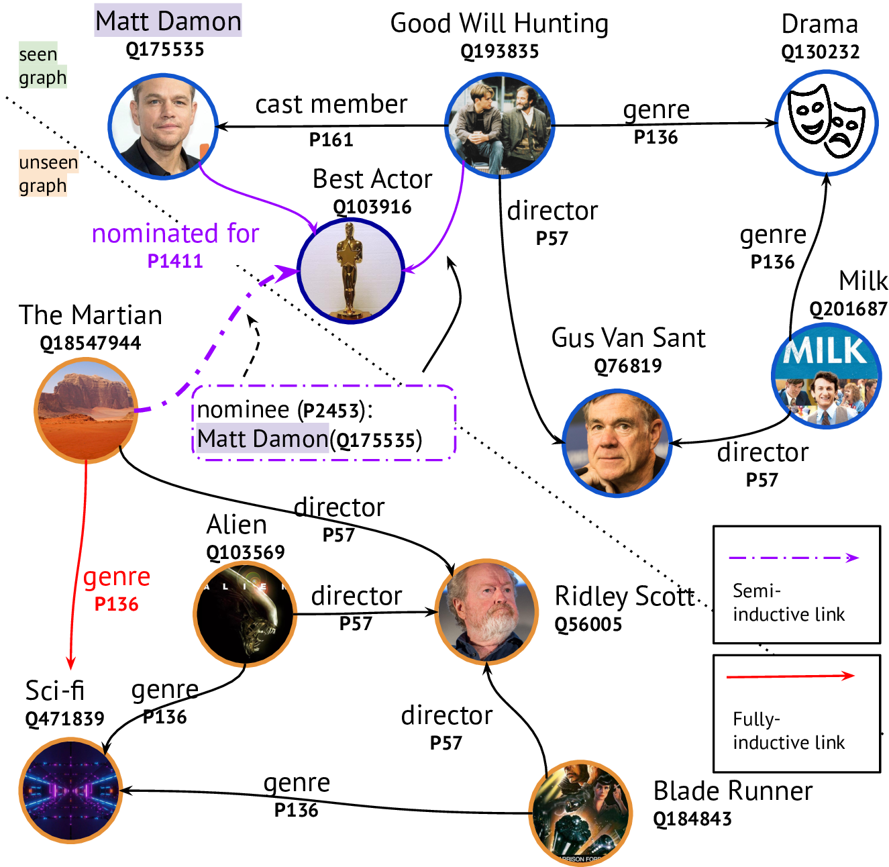

# Improving Inductive Link Prediction Using Hyper-Relational Facts

[](https://docs.python.org/3.8/)
[](https://pytorch.org/docs/stable/index.html)
[](https://opensource.org/licenses/MIT)
[](https://arxiv.org/abs/2107.04894)



This repository contains the code accompanying the paper

```
@misc{ali2021improving,
    title={Improving Inductive Link Prediction Using Hyper-Relational Facts},
    author={Mehdi Ali and Max Berrendorf and Mikhail Galkin and Veronika Thost and Tengfei Ma and Volker Tresp and Jens Lehmann},
    year={2021},
    eprint={2107.04894},
    archivePrefix={arXiv},
    primaryClass={cs.LG}
}
```

# Data

Our code automatically downloads required data if it is missing. By default, it searches in `~/.data/ilp`.

# Installation

We recommend to work with a virtual environment. You can create one, e.g., using Python's builtin [`venv`](https://docs.python.org/3/library/venv.html) module:

```bash
python3 -m venv venv
source venv/bin/activate
```

Please install PyTorch and PyTorch Geometric first, following the instructions from PyTorch Geometric's [documentation](https://pytorch-geometric.readthedocs.io/en/latest/notes/installation.html). Notice that you will first need to install PyTorch, and then select the installation command appropriately based on the chosen torch variant.

Afterwards, you can install all remaining dependencies as well as our package by simply using

```bash
pip install .
```

If you plan to modify the code, consider pip's `--editable` flag:

```bash
pip install -e .
```

# Usage

For high-level usage, we provide a command line interface for both, hyperparameter search as well as running single configurations. If you installed the package via `pip`, a new `ilp` command should be available in your environment. Otherwise, we also provide a small wrapper script around the CLI, [./executables/main.py](executables/main.py), which you can use, e.g., to start CLI commands in debug mode from your IDE.

You can run `ilp --help` to get an overview of the available commands. We further discuss them below.

## Datasets

The datasets can be downloaded at https://zenodo.org/record/6581274#.Yo5Ki8ZCRTY.

## Individual configurations

To start individual configurations use `ilp run`, e.g.,

```bash
ilp run qblp
```

## Hyperparameter Search (HPO)

To start an HPO, use `ilp tune`, e.g.,

```bash
ilp tune --model stare
```

To get further information about the command line parameters, pass `--help`.

*Note*: Running the full HPO takes a considerable amount of time.

# Results

We also provide the configurations and results of the best models from our hyperparameter search in [./best_configs](./best_configs).
